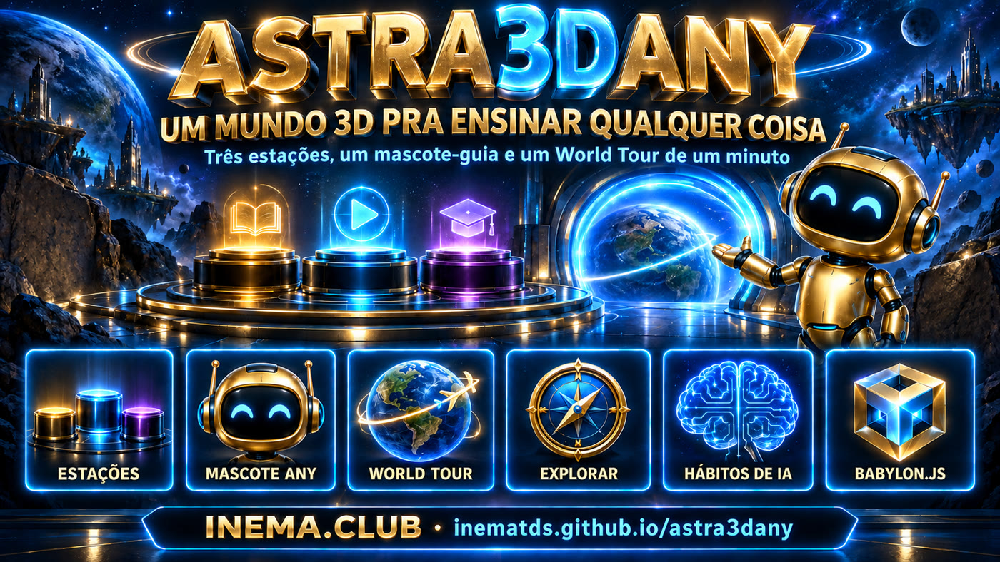

# astra3dany — un mundo 3D para enseñar cualquier cosa

**🇧🇷 [Português](README.md) · 🇺🇸 [English](README.en.md) · 🇪🇸 [Español](README.es.md)**

[](https://inematds.github.io/astra3dany/guia/es/)

**En vivo:** https://inematds.github.io/astra3dany/app/ · **Guía de uso:** https://inematds.github.io/astra3dany/guia/es/

Un «mundo de aprendizaje» en miniatura, en el navegador: tres estaciones, una mascota guía, un World Tour con ritmo y exploración libre.
Cada estación muestra **una idea en acción** (antes → después) con una tarjeta que explica qué ves, qué está pasando y qué debes recordar.

El primer mundo enseña **«IA en el día a día: tres hábitos que evitan problemas»**, en portugués, para adultos que empiezan a usar IA en el trabajo:

| # | Estación | Hábito | Qué sucede |
|---|---|---|---|
| 01 | La puerta | Confirma antes de actuar | Una solicitud se bloquea y pasa a revisión; la segunda supera la verificación, la puerta se abre y la acción se ejecuta |
| 02 | Los cajones | Da contexto donde la IA lee | La tarjeta de instrucciones entra en el cajón del proyecto y los dos colegas quedan conectados |
| 03 | La verificación | Verifica la fuente | El formato pasa; la verificación corrige el total de 100 a 90 y deja la fecha pendiente |

Sigue la receta de la field guide **Build a Learning World** (Mark Kashef, comunidad Early AI Adopters): seis partes, ritmo de cámara *llegar → acercarse → demostrar → mantener*, tarjetas sincronizadas y checklist de aceptación. El material de estudio está en [`docs/`](docs/00-INDICE.md); la síntesis en [`docs/05-sintese.md`](docs/05-sintese.md); el plan en [`PLANO.md`](PLANO.md); las evidencias de inspección en [`evidence/revisao.md`](evidence/revisao.md).

## 📖 Guía de uso

Guía completa (landing + paso a paso): **https://inematds.github.io/astra3dany/guia/es/**

## Instalación

Requisitos previos:

- **Node.js 20 o posterior** (desarrollado y probado con Node 24.13) y **npm**.
- Un navegador con **WebGL2** (Chrome, Edge, Firefox, Safari 15+). No necesita una GPU dedicada, pero ayuda.
- No requiere backend, clave de API, base de datos ni Blender: el sitio es 100% estático.

```bash
git clone https://github.com/inematds/astra3dany.git
cd astra3dany/game
npm ci                 # instala exactamente las versiones de package-lock (Vite 8.2.2, Babylon.js 9.25.0)
npm run dev            # servidor de desarrollo en http://127.0.0.1:43220
```

Otros comandos, siempre dentro de `game/`:

| Comando | Qué hace |
|---|---|
| `npm test` | 7 pruebas de la timeline y los subtítulos del tour (`node --test`, sin navegador) |
| `npm run build` | genera el sitio estático en **`../app/`** (rutas relativas, se sirve desde cualquier carpeta) |
| `npm run preview` | sirve el build de `../app/` en http://127.0.0.1:43221 para inspeccionar lo que se publicará |

Sin internet, `npm run dev` funciona normalmente después de `npm ci`; ningún asset proviene de una CDN.

## Uso

**Abrir:** https://inematds.github.io/astra3dany/app/ (o `npm run dev`). Agrega `?diagnostics` a la URL para ver los fps, p95 y la resolución de render en una esquina del escenario.

**World Tour** (botón naranja): ~60 segundos guiados. Por estación: llegada (3 s) → acercamiento (3 s) → demostración (6 s) → resultado estático (5 s); al final, el resumen con los tres hábitos.
- *Pausar / Reanudar* congela la cámara y la demostración (también con la barra espaciadora o con el enlace «Pausar para leer» de la tarjeta).
- *Reiniciar* vuelve al inicio; *0,75× / 1×* cambia la velocidad; *Salir* o `Esc` vuelve a la vista general.
- En escritorio, la tarjeta queda a la derecha y la escena se renderiza junto a ella; en el celular, la tarjeta queda abajo. La tarjeta nunca cubre la demostración.

**Explora a tu ritmo:** haz clic en un pedestal (o en los botones 01/02/03).
- *Ver de cerca y ejecutar* acerca la cámara y ejecuta la demostración; *Repetir la demostración* la ejecuta de nuevo; *Vista amplia* aleja la cámara; *Próxima estación* avanza; la tercera lleva al resumen.
- La frase de la tarjeta cambia junto con lo que sucede en la escena; en la estación 3, los valores (total y fecha) también aparecen en texto.

**Cámara libre** (fuera del tour):

| Acción | Mouse | Teclado | Touch |
|---|---|---|---|
| Orbitar | arrastrar | flechas | un dedo |
| Acercar / alejar | rueda, botones + y − | `+` / `-` | pellizcar |
| Desplazar (pan) | shift + arrastrar, botón derecho o central | — | dos dedos |
| Volver al encuadre | botón *Reset* | `R` | botón *Reset* |

**Reducir movimiento:** respeta `prefers-reduced-motion` del sistema y se puede activar o desactivar en la parte superior. Cuando está activado, la cámara salta directamente a cada posición en vez de animarse; las demostraciones continúan.

**Fuentes y créditos:** enlace en el pie de la barra lateral.

## Cambiar el tema (enseñar otra cosa)

1. Edita **`game/src/mundo.config.js`**: título, intro, público, mascota y las tres estaciones (nombre, principio, explicación, secuencia, observaciones según el tiempo de la demo, takeaway, posiciones de cámara). Todo el texto del sitio proviene de ahí.
2. Si la mecánica de una estación es diferente, crea un módulo en `game/src/estacoes/` con la interfaz `{ reset(), update(demoTime), foco, pick }` y regístralo en `DEMOS` en `main.js`. Los tres módulos existentes sirven de modelo: son metáforas físicas que ya demostraron ser legibles en primer plano.
3. Ejecuta `npm test` (las pruebas leen el config: duración, pausas de 5 s, frases por fase) e inspecciona en el navegador: vista amplia, primer plano, demo, resultado, escritorio y celular.

Regla de la guía: *cambia el tema, mantén la receta*. Una estación = un principio = una metáfora física = un cambio visible.

## Límites conocidos

- **Mascota procedural.** Blender no estaba disponible en la máquina de build (aarch64), así que la mascota Any se genera mediante código (`game/src/mascote.js`). Para usar un asset de Blender, exporta un GLB a `game/public/assets/`, indica `mascote.glb` en el config y nombra las piernas `Perna1..4` (o `Leg1..4`) para que pueda caminar.
- **Tamaño.** El bundle principal tiene ~5,8 MB (1,2 MB gzip) debido a Babylon.js; la primera carga en 4G tarda unos segundos. Todavía no hay code-splitting.
- **Rendimiento.** Solo se midió en Chromium headless con WebGL por software (25–35 fps), lo que no representa un dispositivo real. En una GPU común se esperan 60 fps; en celulares antiguos, reduce `hardwareScalingLevel` en `main.js` o desactiva las sombras en `palco.js`.
- **No se probó** en un dispositivo físico, Safari o Firefox, ni con gestos táctiles reales (el pellizco solo se probó mediante código).
- **Sin audio, sin quiz, sin IA en vivo.** Las demostraciones son animaciones deterministas; la voz y la música quedan para una próxima versión.
- **Un solo idioma.** Textos en portugués en el config; no hay i18n.
- **Accesibilidad parcial.** Se puede navegar por los botones y paneles con el teclado, y la tarjeta del tour tiene `aria-live`, pero la escena 3D no tiene una descripción alternativa además de las tarjetas.

## Publicar

`npm run build` genera `app/` (estático, rutas relativas). El repositorio se sirve mediante **GitHub Pages desde la raíz de la rama `main`**, así que basta con hacer commit de `app/` y `guia/` y hacer push:

- App: `https://inematds.github.io/astra3dany/app/`
- Guía: `https://inematds.github.io/astra3dany/guia/es/`

También funciona en Vercel, Netlify o Here.Now apuntando a la carpeta `app/`. Publica siempre el build que inspeccionaste con `npm run preview`.

## Estructura

```
app/                          build estático publicado (generado por npm run build)
guia/index.html               página landing + guía de uso (GitHub Pages)
game/index.html               diseño, paneles y controles
game/src/main.js              engine, escena, máquina de estados, tour, UI
game/src/mundo.config.js      DATOS del mundo (tema, estaciones, textos, cámara)
game/src/tour.js              timeline y cues del World Tour (sin Babylon, probado)
game/src/palco.js             suelo, pedestales, luces, sombras, placas de texto
game/src/mascote.js           mascota procedural / cargador GLB
game/src/camera-controls.js   órbita, pan, zoom, teclado, touch
game/src/estacoes/*.js        las tres mecánicas
game/tests/tour.test.mjs      7 pruebas de timing y narración
evidence/                     capturas de pantalla y revisión de la inspección
docs/                         publicación, guía, prompt, transcripción, síntesis
```

## Créditos

Receta, ritmo y checklist: [Build a Learning World](https://build-a-learning-world.markkashef.chatgpt.site/) y el repo [promptadvisers/early-ai-dopters](https://github.com/promptadvisers/early-ai-dopters), de Mark Kashef. Este proyecto vuelve a implementar la receta con un tema, textos, mascota y código propios. Licencia MIT.
